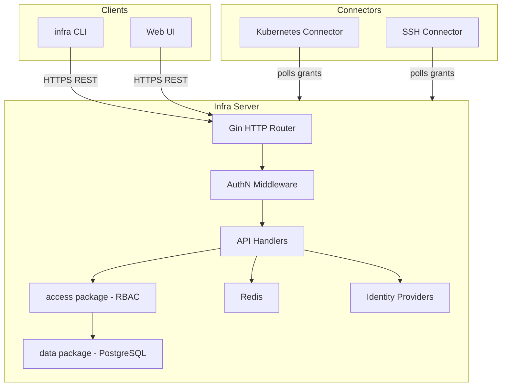
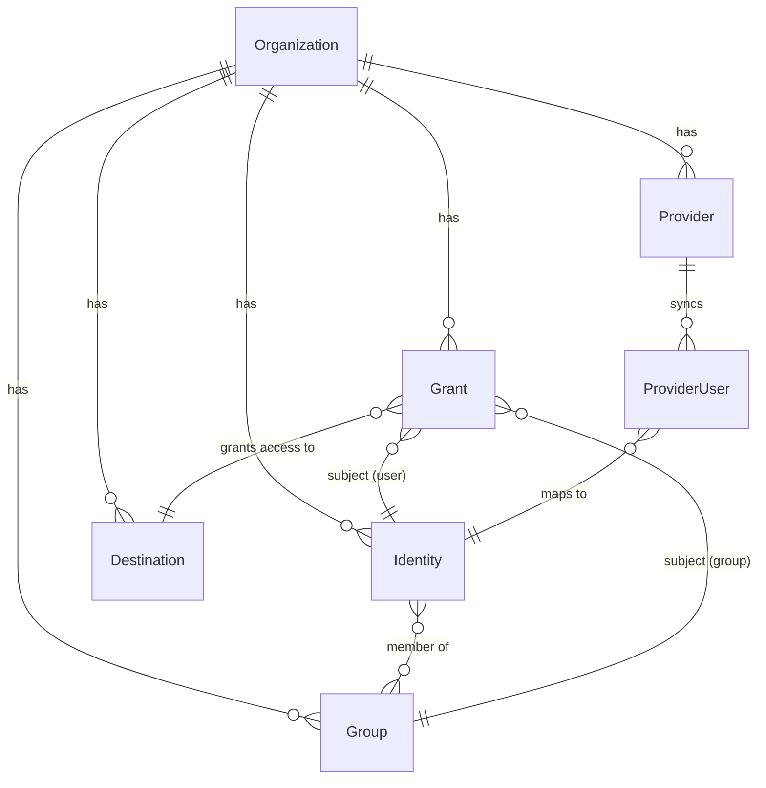

# Agent Guide: InfraHQ Codebase

> **For AI assistants:** This document is the primary context file for the InfraHQ codebase. It covers project structure, coding conventions, development patterns, and task-specific guidance. Detailed documentation is also available in `.sop/summary/` — see the [Extended Documentation](#extended-documentation) section at the bottom.

---

## Table of Contents

1. [Project Overview](#project-overview)
2. [Repository Structure](#repository-structure)
3. [Development Commands](#development-commands)
4. [Architecture](#architecture)
5. [Code Organization & Patterns](#code-organization--patterns)
6. [Data Models](#data-models)
7. [API Reference](#api-reference)
8. [Testing Guide](#testing-guide)
9. [Code Style and Conventions](#code-style-and-conventions)
10. [Important Gotchas](#important-gotchas)
11. [Common Tasks](#common-tasks)
12. [Security Considerations](#security-considerations)
13. [Deployment](#deployment)
14. [Extended Documentation](#extended-documentation)

---

## Project Overview

**InfraHQ** (`github.com/infrahq/infra`) is an authentication and access management platform for servers, clusters, and databases.

| | |
|---|---|
| **Module** | `github.com/infrahq/infra` |
| **Version** | 0.21.10 |
| **Backend** | Go 1.25 |
| **Frontend** | Next.js 14.2 / React / JavaScript (not TypeScript) |
| **Database** | PostgreSQL (pgx v4 driver) |
| **Cache** | Redis (go-redis v8) |
| **HTTP Framework** | Gin (infrahq fork — see gotchas) |
| **CLI Framework** | Cobra + pflag |

**Core capabilities:**
- User authentication via OAuth2/OIDC device flow (Google, Azure AD, Okta, generic OIDC)
- Role-based access grants to Kubernetes clusters and SSH hosts
- Multi-tenant organization model
- SCIM 2.0 user provisioning
- Access key (JWT) management

---

## Repository Structure

```
.
├── main.go                         # Entry point → cmd.Run()
├── api/                            # Shared API request/response types + HTTP client (25 files)
├── internal/
│   ├── access/                     # Authorization layer (RBAC enforcement)
│   ├── certs/                      # TLS certificate utilities
│   ├── claims/                     # JWT claim type definitions
│   ├── cmd/                        # CLI commands via Cobra (55 files)
│   │   ├── cliopts/                # CLI option types
│   │   └── types/                  # Shared type definitions (HostPort, etc.)
│   ├── connector/                  # Kubernetes & SSH connector runtime
│   ├── docgen/                     # Documentation generation tooling
│   ├── format/                     # Output formatters (tables, JSON)
│   ├── generate/                   # Code generation utilities
│   ├── ginutil/                    # Gin middleware helpers
│   ├── kubernetes/                 # Kubernetes API client wrapper (RBAC, secrets)
│   ├── linux/                      # Linux-specific utilities
│   ├── logging/                    # Logging config (zerolog)
│   ├── openapi3/                   # OpenAPI 3 document builder
│   ├── openapigen/                 # OpenAPI spec generation
│   ├── race/                       # Race condition test helpers
│   ├── repeat/                     # Background task scheduler
│   ├── server/                     # HTTP server + all API handlers (63 files)
│   │   ├── authn/                  # Authentication middleware (token validation)
│   │   ├── data/                   # Database access layer (45 files)
│   │   │   ├── encrypt/            # Field-level AES-GCM encryption
│   │   │   ├── migrator/           # DB migration engine
│   │   │   └── querybuilder/       # Type-safe SQL query builder
│   │   ├── email/                  # Email sending utilities
│   │   ├── models/                 # Domain model structs
│   │   ├── providers/              # Identity provider adapters (google, azure, oidc)
│   │   └── redis/                  # Redis client wrapper
│   ├── testing/                    # Test helpers & DB fixtures
│   │   ├── database/               # DB test fixtures
│   │   └── patch/                  # Test patching utilities
│   ├── tools/
│   │   └── querylinter/            # Linter: enforces safe query builder usage
│   └── validate/                   # Request validation helpers
├── metrics/                        # Prometheus metrics definitions + Gin middleware
├── uid/                            # Custom ID type (base58-encoded 16-byte UUID)
├── ui/                             # Next.js frontend
│   ├── components/                 # Reusable React components
│   ├── lib/                        # Client utilities (fetch, SWR hooks, auth)
│   ├── pages/                      # Next.js page routes
│   └── styles/                     # Global CSS (Tailwind)
├── charts/                         # Helm charts: infra, infra-server
├── docs/                           # End-user documentation + OpenAPI spec
├── dev/                            # Local dev config (server.yaml, connector-values.yaml)
├── test/                           # Integration test infrastructure (Docker Compose)
├── .github/workflows/              # CI/CD pipelines
└── Makefile                        # Build targets
```

### Key Files

| File | Purpose |
|---|---|
| `main.go` | Entry point; error classification and os.Exit |
| `internal/cmd/cmd.go` | `Run()` + CLI root setup |
| `internal/server/server.go` | `Server` struct, `Options`, lifecycle, TLS, Redis/DB init |
| `internal/server/routes.go` | **All** route registrations + middleware chain |
| `internal/server/data/data.go` | `DB` struct, `NewDB()`, transaction helpers |
| `internal/server/models/` | Domain model structs (Identity, Grant, Destination, …) |
| `internal/access/access.go` | `ErrNotAuthorized`, `AuthorizationError`, RBAC checks |
| `api/client.go` | HTTP client used by the CLI and tests |
| `ui/pages/` | Next.js pages (login, destinations, users, groups, …) |
| `ui/lib/fetch.js` | SWR-based API hooks |

---

## Development Commands

### Backend (Go)

```bash
# Build the CLI/server binary
make bin/infra

# Short tests (unit, no slow DB tests)
make test

# All tests including UI and integration
make test-all

# Lint
make lint

# Format
go fmt ./...

# Vet
go vet ./...

# Start Postgres dev container
make postgres

# Run the server (requires postgres)
INFRA_SERVER_CONFIG_FILE=dev/server.yaml ./bin/infra server
```

### Frontend (Next.js/React)

```bash
cd ui/
npm install
npm run dev     # dev server on :3000
npm test        # Jest tests
npm run lint    # ESLint
npm run build   # production build
```

### CI/CD Workflows (`.github/workflows/`)

| File | Trigger | Purpose |
|---|---|---|
| `ci-core.yaml` | push / PR | Go vet, golangci-lint, tests with multiple PostgreSQL versions |
| `ci-ui.yaml` | push / PR | npm lint, build, Jest tests |
| `fuzz.yaml` | scheduled (weekly) | Go fuzzing for security |
| `cd-binaries.yaml` | tag | goreleaser cross-platform binary builds |
| `cd-containers.yaml` | tag | Docker image push to `registry.gitlab.com/ska-telescope/sdi/external/infra` |

---

## Architecture

### System Overview



### Request Pipeline

Every API request flows through:
1. `loggingMiddleware` (all routes)
2. `metrics.Middleware` (API routes)
3. `authenticateRequestIfPresent` (injects `Identity` + `Organization` into context)
4. `CSRFMiddleware` (cookie-auth routes, if enabled)
5. `wrapRoute[Req, Res]` — decode body → validate → call handler → map error → write JSON

### Multi-Tenancy

All database queries are automatically scoped by `organization_id`. Models embed `OrganizationMember`:
```go
type OrganizationMember struct {
    OrganizationID uid.ID
}
```

### Authentication (Device Flow)

```
infra login → POST /api/login → get device_code
→ browser opens IDP → callback to /api/redirect
→ server issues AccessKey (JWT) → CLI stores in ~/.infra/config
```

---

## Code Organization & Patterns

### Route Handler Pattern

All handlers use a generic wrapper:
```go
type route[Req, Res any] struct {
    handler      func(rCtx *RequestContext, req Req) (Res, error)
    routeID      routeIdentifier
    authRequired bool
}
```
`wrapRoute[Req, Res]` handles: JSON binding → `go-playground/validator` → handler → error → JSON response.

Register routes in `internal/server/routes.go` inside `GenerateRoutes()`.

### Database Table Pattern

Every table entity implements:
```go
type Table interface {
    Table() string    // returns table name string literal
    Columns() []string // MUST return ONLY string literals (enforced by querylinter)
    Values() []any
}
```

Example (from `data/grant.go`):
```go
type grantsTable models.Grant

func (g grantsTable) Table() string { return "grants" }
func (g grantsTable) Columns() []string {
    return []string{"created_at", "created_by", "deleted_at", "id",
        "organization_id", "privilege", "resource", "subject_id", "subject_kind", "updated_at"}
}
```

After changing a model struct, run:
```bash
go generate ./internal/server/data
```

### Access / Authorization Pattern

All handlers must call `access.*` functions **before** touching the database:
```go
// Example in a handler:
if err := access.CreateGrant(rCtx); err != nil {
    return nil, err  // returns AuthorizationError if insufficient role
}
// safe to call data layer now
grant, err := data.CreateGrant(rCtx.DBTxn, &models.Grant{...})
```

`internal/access/` is the **single enforcement point** for RBAC. Never bypass it.

### Background Tasks

Use `internal/repeat` for scheduled server-side tasks (grant sync, token cleanup):
```go
repeat.Start(ctx, interval, func(ctx context.Context) error { ... })
```

### Identity Provider Adapters

Each provider in `internal/server/providers/` implements auth URL generation, code exchange, user info retrieval, and group membership sync. The three adapters are `google.go`, `azure.go`, and `oidc.go`.

### Frontend Data Fetching

UI pages use SWR hooks from `ui/lib/fetch.js`:
```js
const { data, error, mutate } = useAPI('/api/users')
```
All API calls go through the same `fetch.js` utility which handles auth headers and error normalization.

---

## Data Models

### Key Domain Models (in `internal/server/models/`)

All models embed `Model` (id, created_at, updated_at, deleted_at, created_by) and `OrganizationMember` (organization_id).

| Model | Table | Description |
|---|---|---|
| `Identity` | `identities` | User account |
| `Organization` | `organizations` | Tenant |
| `Grant` | `grants` | Privilege + resource + subject (user or group) |
| `Destination` | `destinations` | Kubernetes cluster or SSH host |
| `Provider` | `providers` | Identity provider config |
| `AccessKey` | `access_keys` | Session token (JWT) |
| `Group` | `groups` | User group (local or provider-synced) |
| `ProviderUser` | `provider_users` | Provider ↔ Identity sync state |
| `EncryptionKey` | `encryption_keys` | AES-GCM key for field encryption |
| `DeviceFlowAuthRequest` | `device_flow_auth_requests` | OAuth2 device flow state |

### Entity Relationships



### UID Type

Primary keys use `uid.ID` — a 16-byte array encoded as base58. Defined in `uid/`. JSON serializes as a string.

### Sensitive Fields

`client_secret`, `access_token`, `refresh_token`, `private_jwk`, and similar columns are encrypted at rest using `internal/server/data/encrypt` (AES-GCM, key stored in `encryption_keys` table).

---

## API Reference

All API routes require the `Infra-Version` header for versioning.

### Core Endpoints

| Resource | Endpoints |
|---|---|
| Auth | `POST /api/login`, `POST /api/logout`, `GET /api/device` |
| Users | `GET/POST /api/users`, `GET/PUT/DELETE /api/users/:id` |
| Groups | `GET/POST /api/groups`, `GET/PUT/DELETE /api/groups/:id` |
| Grants | `GET/POST /api/grants`, `GET/DELETE /api/grants/:id` |
| Destinations | `GET/POST /api/destinations`, `GET/PUT/DELETE /api/destinations/:id` |
| Providers | `GET/POST /api/providers`, `GET/PUT/DELETE /api/providers/:id` |
| Access Keys | `GET/POST /api/access-keys`, `DELETE /api/access-keys/:id` |
| Organizations | `GET/POST /api/organizations`, `GET/PUT/DELETE /api/organizations/:id` |
| SCIM | `/api/scim/v2/Users`, `/api/scim/v2/Groups` |
| Misc | `GET /healthz`, `POST /api/signup`, `GET /api/server-configuration` |

Full OpenAPI 3.0 spec: `docs/api/openapi3.json`

### API Versioning

Requests include `Infra-Version: 0.x.y`. Semver routing picks the correct handler. For breaking changes, create a new handler copy with a version suffix. See `docs/dev/api-versioned-handlers.md`.

---

## Testing Guide

### Backend

```bash
# Short unit tests (no DB required)
go test -short ./...

# All tests (requires PostgreSQL)
POSTGRESQL_CONNECTION="host=localhost port=5432 user=$(whoami) dbname=postgres" go test ./...

# With race detector
go test -race ./...

# Specific package
go test ./internal/server/...

# Update golden test output files
go test ./internal/cmd -test.update-golden
```

### Frontend

```bash
cd ui
npm test                        # Jest
npm test -- --update-golden     # update snapshots
```

### Test Utilities

- `internal/testing/` — test helpers (server setup, identity creation, etc.)
- `internal/testing/database/` — DB fixture helpers
- `internal/testing/patch/` — test patching for time, crypto, etc.
- `github.com/alicebob/miniredis/v2` — in-memory Redis for tests
- `github.com/Netflix/go-expect` + PTY — for CLI integration tests

---

## Code Style and Conventions

### Go

- **Error handling**: Always check errors; wrap with `fmt.Errorf("context: %w", err)`
- **Logging**: `github.com/rs/zerolog` — use `log.Ctx(ctx)` for request-scoped logs
- **Context**: Pass `ctx context.Context` as the first argument to all functions that do I/O
- **Validation**: Use `go-playground/validator/v10` struct tags on request types in `api/`
- **JSON**: `snake_case` field names
- **Nil checks**: Check for `nil` before dereferencing pointers from DB queries
- **Soft deletes**: Models with `DeletedAt *time.Time` are soft-deleted; queries must filter `deleted_at IS NULL`

### Database Query Builder

```go
// Correct — Columns() with only string literals
func (g grantsTable) Columns() []string {
    return []string{"id", "privilege", "resource", ...}
}

// WRONG — do not compute column names dynamically
// return []string{someVar, "resource"}  ← linter will reject this
```

### Frontend (JavaScript, not TypeScript)

- Functional React components with hooks
- Tailwind CSS utility classes (no inline styles)
- SWR for all data fetching — use `mutate()` to invalidate after mutations
- Pages in `ui/pages/` use Next.js file-based routing
- No TypeScript — plain JavaScript with JSDoc where needed

### File Organization

- One model per file in `internal/server/models/`
- One resource per file in `internal/server/data/` (e.g., `grant.go`, `destination.go`)
- Handler functions co-located with their resource in `internal/server/` (e.g., `grants.go`)

---

## Important Gotchas

### Gin Binding Compatibility

The project now uses upstream `github.com/gin-gonic/gin` directly. Request binding for `uid.ID`, `api.IDOrSelf`, and repeated `[]uid.ID` query parameters is preserved locally in `internal/server/routes.go` via a small `encoding.TextUnmarshaler` compatibility shim.

### Database Operations

1. **Generated Methods**: After changing table structs, run `go generate ./internal/server/data`
2. **Column Safety**: `Table.Columns()` must return **only string literals** (enforced by `internal/tools/querylinter`)
3. **Organization Scoping**: All queries are auto-scoped; never skip `OrganizationID`
4. **Soft Deletes**: Filter on `deleted_at IS NULL` — the query builder handles this, but be aware when writing raw SQL in migrations

### API Versioning

- All API requests need `Infra-Version` header
- Create a copy of handler structs (with version suffix) for breaking changes
- See `docs/dev/api-versioned-handlers.md` for the pattern

### Access Layer

- **Never** call `data.*` functions to check permissions — use `access.*` only
- `access.ErrNotAuthorized` must propagate to the client as HTTP 403

### Frontend

- The frontend is **JavaScript, not TypeScript** — no `.ts` or `.tsx` files
- API types are not shared between frontend and backend (frontend uses plain JS objects)
- SWR cache keys are the API paths — use `mutate('/api/users')` to invalidate

### Connector Access Keys

Connectors use a special access key with `connector` scope. These are created via the UI under `Settings → Connector Keys` and passed in `dev/connector-values.yaml`.

---

## Common Tasks

### Adding a New API Endpoint

1. Define request/response structs in `api/<resource>.go`
2. Add handler function in `internal/server/<resource>.go`
3. Register route in `GenerateRoutes()` in `internal/server/routes.go`
4. Add authorization check in `internal/access/<resource>.go`
5. Write tests alongside the handler
6. OpenAPI spec regenerates automatically on server start

### Adding a Database Table

1. Create model struct in `internal/server/models/` embedding `Model` + `OrganizationMember`
2. Create table type in `internal/server/data/<resource>.go` implementing `Table` interface
3. Add `CREATE TABLE` migration in `internal/server/data/migrations.go`
4. Run `go generate ./internal/server/data` to regenerate helper methods
5. Implement CRUD functions in the same data file
6. Add tests

### Adding a CLI Command

1. Create `internal/cmd/<command>.go` with a `new<Command>Cmd(cli *CLI) *cobra.Command`
2. Register the command in `NewRootCmd()` in `internal/cmd/cmd.go`
3. Use `defaultClientOpts()` to get an API client
4. Add tests (use PTY-based test for interactive commands)

### Adding a Frontend Page

1. Create `ui/pages/<route>/index.js` (or `[id].js` for dynamic routes)
2. Fetch data with `useAPI('/api/<resource>')` from `ui/lib/fetch.js`
3. Use existing components from `ui/components/`
4. Add Jest tests in `ui/__test__/`

### Adding an Identity Provider

1. Create `internal/server/providers/<name>.go` following the pattern of `google.go`/`azure.go`
2. Add provider `Kind` constant
3. Register in the provider factory in `internal/server/providers/`
4. Add UI configuration in the providers settings page

---

## Security Considerations

- **Input Validation**: All request structs in `api/` use `go-playground/validator` tags
- **SQL Safety**: Only use `internal/server/data/querybuilder` — no raw SQL in handlers
- **Field Encryption**: Sensitive DB columns use `internal/server/data/encrypt` (AES-GCM)
- **RBAC**: All mutations go through `internal/access/` — never bypass
- **CSRF**: Enabled by default for cookie-auth routes (`CSRFMiddleware`)
- **TLS**: Server requires TLS; self-signed cert generated for dev
- **Access Keys**: JWT with expiry + inactivity timeout; stored encrypted

---

## Deployment

- **Docker**: `Dockerfile` at repo root; `ui/Dockerfile` for frontend
- **Kubernetes**: Helm charts in `charts/infra-server/` and `charts/infra/`
- **Configuration**: Environment variables or YAML config file (`INFRA_SERVER_CONFIG_FILE`)
- **Registries**: Images pushed to `registry.gitlab.com/ska-telescope/sdi/external/infra`
- **Releases**: goreleaser builds Linux/macOS/Windows binaries; artifacts in `dist/`

Key environment variables:
```
INFRA_SERVER_DB_HOST / INFRA_SERVER_DB_NAME / INFRA_SERVER_DB_USERNAME / INFRA_SERVER_DB_PASSWORD
INFRA_SERVER_REDIS_ADDR
INFRA_SERVER_TLS_CACHE
INFRA_ACCESS_KEY   (for CLI authentication)
```

---

## Extended Documentation

Detailed structured documentation is available in `.sop/summary/`:

| File | Contents |
|---|---|
| `.sop/summary/index.md` | **Start here** — knowledge base index for AI assistants |
| `.sop/summary/architecture.md` | System diagrams, request pipeline, auth flow, design patterns |
| `.sop/summary/components.md` | Detailed per-component descriptions |
| `.sop/summary/interfaces.md` | Full REST API endpoint table, Go interfaces, SCIM details |
| `.sop/summary/data_models.md` | ERD, full model struct definitions, schema notes |
| `.sop/summary/workflows.md` | Sequence diagrams: login, K8s access grant, IDP sync, SSH, startup |
| `.sop/summary/dependencies.md` | All Go + frontend dependencies with versions |
| `.sop/summary/review_notes.md` | Known documentation gaps and recommendations |

---

## Group Mapping Rules

Group Mapping Rules is a rule-based engine that automatically creates access grants based on IDP group membership. The feature spans the full stack: DB migrations, domain model, data layer, authorization, HTTP handlers, a regex-based mapping engine, SSH connector integration, and an admin UI.

### Architecture

```
Admin UI (/mapping-rules) → API handlers (mapping_rules.go)
  → access layer (access/mapping_rule.go, InfraAdminRole)
    → data layer (data/mapping_rule.go)
      → EvaluateMappingRulesAsync (mapping_rule_engine.go)  ← async, own txn
        → EvaluateMappingRules (sync)
          → createOrUpdateGrant + cleanupStaleGrants
        → recordEvalStatus → evalStatusStore (in-memory)
```

Eval status is exposed via `GET /api/mapping-rules/eval-status` and displayed as a banner in the UI.

### Key Files

| File | Purpose |
|---|---|
| `api/mapping_rule.go` | Request/response types + validation (regex compile check, enum, conditional required) + `MappingRuleEvalStatus` |
| `internal/server/models/mapping_rule.go` | `MappingRule` domain model, `DestinationType` enum, `ToAPI()` converter |
| `internal/server/data/mapping_rule.go` | Data layer CRUD + `mappingRulesTable` implementing the `Table` interface |
| `internal/server/mapping_rules.go` | HTTP handlers (List/Get/Create/Update/Delete/EvalStatus), Create/Update/Delete trigger `EvaluateMappingRulesAsync` |
| `internal/server/mapping_rule_engine.go` | Core engine: `EvaluateMappingRules`, `EvaluateMappingRulesAsync`, `applyTemplate`, `createOrUpdateGrant`, `cleanupStaleGrants`, `EvalStatusReport` + in-memory status store |
| `internal/access/mapping_rule.go` | Authorization: all endpoints require `InfraAdminRole` |
| `internal/server/data/migrations.go` | Migrations: `mapping_rules` table + `auto_grant` column on `grants` + partial index |
| `internal/server/data/schema.sql` | `mapping_rules` DDL with unique partial index |
| `internal/connector/ssh.go` | `resolveUsersFromGrants`: resolves group-based grants to individual users |
| `ui/pages/mapping-rules/index.js` | List page with inline add dialog, pagination, search, live regex preview |
| `ui/pages/mapping-rules/add.js` | Add/edit form with live regex/template preview, unsaved changes warning |
| `ui/lib/mappingRules.js` | Client-side `previewRegex()` and `previewTemplate()` utilities |
| `docs/mapping-rules.md` | End-user documentation with examples and template syntax reference |

### Engine Behavior

- **Triggered by**: rule CRUD (create/update/delete), group creation, server startup, login (to catch IDP-synced groups)
- **Admin-only**: All mapping rule endpoints require `InfraAdminRole` — the UI already enforces this
- **Async execution**: All request-triggered evaluations run asynchronously in a background goroutine with their own DB transaction, so the API response is not blocked by evaluation
- **No semaphore or shutdown context needed**: `EvaluateMappingRules` is idempotent — early termination is harmless because the next run picks up the correct state. `pg_try_advisory_xact_lock(orgID)` already serializes concurrent evaluations per org. Together these make additional semaphores or shutdown-context plumbing unnecessary.
- **Eval status visibility**: Result of each async evaluation is recorded in an in-memory `evalStatusStore` and exposed via `GET /api/mapping-rules/eval-status` — the UI shows a success/error banner
- **Locking**: `pg_try_advisory_xact_lock(orgID)` prevents concurrent evaluation races
- **Idempotent**: `createOrUpdateGrant` checks for existing grants before creating; marks pre-existing matches as `auto_grant=true`
- **Auto-grant safety**: Only grants with `AutoGrant=true` (only the mapping engine sets this) are cleaned up. Manually-created grants are never touched.
- **Graceful degradation**: Invalid regex or template errors are logged and skipped — one bad rule does not crash the engine
- **Cross-org isolation**: All queries are scoped by `organization_id`

### Adding a Mapping Rule (Developer Guide)

1. **Model**: Already exists in `internal/server/models/mapping_rule.go` — add fields to `MappingRule` struct
2. **API types**: Define/update request/response in `api/mapping_rule.go`
3. **Data layer**: Update `mappingRulesTable` in `internal/server/data/mapping_rule.go` — columns, values, scan fields
4. **Migration**: Add migration in `internal/server/data/migrations.go` + update `schema.sql`
5. **Run**: `go generate ./internal/server/data`
6. **Handlers**: Add/update in `internal/server/mapping_rules.go`
7. **Access**: Update `internal/access/mapping_rule.go` for any permission changes
8. **Routes**: Registered in `internal/server/routes.go` (get/post/put/del for `/api/mapping-rules`)
9. **Engine**: If changing evaluation logic, update `internal/server/mapping_rule_engine.go`
10. **Tests**: Add tests at every layer (engine, handlers, access, data, integration)
11. **Frontend**: Update `ui/pages/mapping-rules/` and `ui/lib/mappingRules.js`
12. **Docs**: Update `docs/mapping-rules.md`

### API Endpoints

| Method | Path | Auth | Description |
|--------|------|------|-------------|
| GET | `/api/mapping-rules` | InfraAdminRole | List rules (paginated, filterable by name) |
| GET | `/api/mapping-rules/eval-status` | InfraAdminRole | Last async evaluation result (success/error + timestamp) |
| GET | `/api/mapping-rules/:id` | InfraAdminRole | Get single rule |
| POST | `/api/mapping-rules` | InfraAdminRole | Create rule (triggers engine) |
| PUT | `/api/mapping-rules/:id` | InfraAdminRole | Update rule (triggers engine) |
| DELETE | `/api/mapping-rules/:id` | InfraAdminRole | Delete rule (triggers engine) |

### Important Gotchas

- **Mutation of existing grants**: `createOrUpdateGrant` marks pre-existing matching grants as `auto_grant=true`. This is intentional — if a user creates a mapping rule that matches an existing manual grant, the user intends for the rule to manage that grant going forward.
- **SSH privilege is always "connect"**: The engine hardcodes `privilege = "connect"` for SSH destinations. Role template is not used for SSH.
- **Kubernetes fallback**: When no `RoleTemplate` is set for a Kubernetes rule, the engine falls back to `"view"` (least-privilege valid RBAC role).
- **Cleanup scope**: `cleanupStaleGrants` only removes grants where `AutoGrant=true` (only the mapping engine sets this). Bootstrap grants and user-created grants are preserved.
- **Template syntax**: Only `$N` (bare number) is supported. `${...}` syntax is explicitly rejected with an error. Use `$1`, `$2`, etc. for capture group references.
- **Orphaned group deletion when no rules exist**: `cleanupOrphanedGroups` deletes *all* IDP-synced groups (`created_by_provider != 0`) when no active mapping rules are configured. This is **by design** — provider-synced groups only serve an access-control purpose when referenced by a mapping rule; without any rules, they are orphaned and safely removed. Locally-created groups (`created_by_provider IS NULL`) are never affected. Admins who want to preserve IDP-synced groups without granting access should create at least one mapping rule with a narrow regex that matches no groups.

### Test Commands

```bash
# Engine unit tests
go test ./internal/server/ -run TestEvaluateMappingRules -v

# HTTP handler tests
go test ./internal/server/ -run TestAPI_MappingRule -v

# Data layer validation tests
go test ./internal/server/data/ -run TestValidateMappingRule -v

# Access control tests
go test ./internal/access/ -run TestMappingRule -v

# Integration tests (requires PostgreSQL)
go test ./internal/server/ -run TestIntegrationMappingRule -v

# Migration tests (requires PostgreSQL)
go test ./internal/server/data/ -run TestMigrations -v

# Frontend tests
cd ui && npm test -- --testPathPattern=mapping-rules
```
